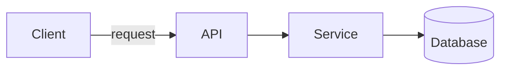

# PR Description

Generate a PR title and markdown summary for the current branch by reading the **actual diff**, not the conversation history.

**Announce at start:** "I'm using the writing-pr skill to write up this branch."

## Process

### 1. Gather the real change

Never trust your memory of the conversation — read what actually changed:

```bash
BASE=$(git merge-base HEAD origin/main 2>/dev/null || git merge-base HEAD main)
git log --oneline "$BASE"..HEAD
git diff "$BASE"...HEAD --stat
git diff "$BASE"...HEAD
```

Read the full diff. The conversation may have drifted from what's committed; the diff is ground truth. (Swap `main` for `master`/`develop` if that's the repo's base branch.)

### 2. Write the title

- Under 70 characters.
- Use the repo's conventional-commit prefix (`feat:`, `fix:`, etc.) **only if** the existing commit history uses them (check `git log` first). When it does, pick the narrowest accurate type — commonly `feat`, `fix`, `refactor`, `perf`, `docs`, `test`, `build`, `ci`, `chore`.
- Describe the outcome/value, not the mechanics. "Add transfers between accounts" beats "Add createTransfer function to actual.ts".
- Name the **dominant** change, not the latest commit. No trailing period.
- Never tag the title with the tool that wrote it — no `[claude]`, `[codex]`, `[ai]`, `[bot]`, or `[wip]` brackets, and no agent/tool attribution. Reviewers care about the change, not who typed it.
- No vague process titles (`update`, `cleanup`, `misc`, `fix stuff`, `address feedback`). If a reviewer read only the title, would they form the right expectation of the diff?

### 3. Write the body

````markdown
## Summary

One or two sentences on what this branch delivers and why.

### What's new   (or "What changed" for refactors/fixes)

- **Lead noun phrase** — what it does, in one line.
- **Another feature** — ...

### Screenshots   (only for user-facing/UI changes)

<!-- Before / after, or a short screen recording. This skill can't capture these — paste them in. -->

### Architecture notes   (only if there are decisions worth flagging)

- Boundaries, deliberate separations, non-obvious tradeoffs.

### Diagram   (only when the change adds or reshapes a flow, data path, or set of relationships)



## Test plan

- [x] Things you actually verified (test suite, typecheck, build)
- [ ] Things the reviewer should still do manually
````

Rules:
- Group bullets by **feature/outcome**, not by file.
- Bold the lead noun of each bullet.
- When the change alters a **contract** — an output shape, config, CLI output, payload, permission, or API/input format — show a compact **before/after in fenced code blocks** instead of describing it in prose. A direct comparison reviewers can diff beats a paragraph.
- Derive the test plan from the repo's real scripts (`package.json`, `Makefile`, CI config). Be honest: `[x]` only what you ran, `[ ]` what's left.
- Add a **Diagram** only when the change introduces or reshapes a flow, data path, or set of relationships — and diagram only the nodes that changed, not the whole system. Use Mermaid (it renders natively on GitHub); for two or three boxes a plain ASCII sketch in a code block is fine. Don't tool up a diagram for a change with no structure to show.
- Add **Screenshots** only for user-facing/UI changes. You can't capture them, so leave the marked placeholder telling the human exactly what to attach (before/after, or a recording).
- **No customer data or PII** — names, emails, org identifiers, support-ticket contents. PR descriptions are usually public: describe the technical symptom, not who hit it, and reference an internal ticket ID instead.
- **Reference issues only with a real ID** pulled from your input, the branch name, or the commits — never invent a placeholder like `#XXXX` or `<issue>`. Use the host's syntax (`Fixes #123` / `Refs #123` on GitHub, or a tracker form like `Fixes SENTRY-1234` when the repo links one), and omit the line entirely when there's no real ID.
- Drop any section that would be empty. Don't pad.

### 4. Output

Print the title and body as **copy-pasteable fenced markdown blocks** — the title in its own block, the body in a separate one. Do **not** run `gh pr create` or push unless the user explicitly asks.

**Critical — fence the body with MORE backticks than anything inside it.** The body almost always contains fenced code blocks (the before/after snippets, the `mermaid` diagram), so wrapping it in a normal three-backtick fence silently breaks: the first inner fence closes the outer block early and the rest of the body spills out as raw text. Count the longest backtick run the body uses (usually three) and open **and** close the body with at least one more — normally a **four-backtick** fence (step to five if an inner block uses four). After writing it, re-read your output and confirm the closing fence sits at the very end, after the Test plan, with nothing leaking out below it.

- If a write-up was all that was asked for: offer the next step — "want me to push and open the PR?" — which `superpowers:finishing-a-development-branch` handles (it owns push, create, and worktree cleanup).
- If the user explicitly asked to push and open the PR: hand the push/create lifecycle to **superpowers:finishing-a-development-branch** rather than calling `gh` yourself. **But if `finishing-a-development-branch` invoked you only for the write-up, return the title and body and stop — it already owns the creation; do not hand back** (handing back would ping-pong the two skills).

### 5. Refreshing an existing write-up (only when asked)

If the user asks to update or refresh a PR that already has a title and body:

- Re-read the **current** diff (Step 1) and compare against that — not the diff from when the PR was first opened.
- Treat the existing title and body as **input, not source of truth**. Rewrite the body as one fresh description of the current diff; don't append a changelog of follow-up commits.
- Re-evaluate the title: keep it only if it still names the dominant change, rewrite it if the scope drifted.
- Output the refreshed title and body as copy-pasteable blocks. As in Step 4, don't push or edit the live PR unless the user asks.

## Example — a change that alters a contract

A schema or output-shape change, using the before/after technique. The Test plan stays — that's deliberate here.

````markdown
Switch run logs to one JSONL record per chunk

Run logs now write a versioned record per analyzed chunk instead of one large
record at the end, so progress is visible as chunks complete.

**Record shape**

Before — one line per run:

```jsonc
{ "run": {...}, "summary": "Found 2 issues", "findings": [...] }
```

After — one line per chunk:

```jsonc
{ "schemaVersion": 1, "run": {...}, "chunk": { "index": 1, "total": 2 }, "findings": [...] }
```

## Test plan

- [x] `npm test` — JSONL writer and reader round-trip
- [ ] Verify `runs follow` renders chunks incrementally in the UI
````

## Red flags

- Writing the summary from conversation memory instead of the diff → wrong/stale.
- Listing changed files instead of describing outcomes → noise, not signal.
- A test plan that claims things you never ran → dishonest.
- Auto-creating the PR when only a write-up was asked for → overreach.
- Adding a diagram to a change with no flow or structure (a rename, a config tweak, a one-liner) → decoration, not signal. Diagram only what's genuinely easier to see than to read.
- Tagging the title with `[claude]`/`[ai]`/`[wip]` or any tool/agent attribution → reviewer slop; name the change, not the author.
- Naming a customer, user, email, or org in the description → PRs are usually public; describe the symptom and use an internal ticket ID.
- Inventing an issue reference like `Fixes #XXXX` when no real ID exists → a false link is worse than none.
- Handing back to `finishing-a-development-branch` when it only invoked you for the write-up → infinite ping-pong. Return the title and body and stop.
- Wrapping a body that contains code fences in a same-width three-backtick block → it breaks at the first inner fence and the rest spills out as raw text. The outer fence must be wider (four backticks).